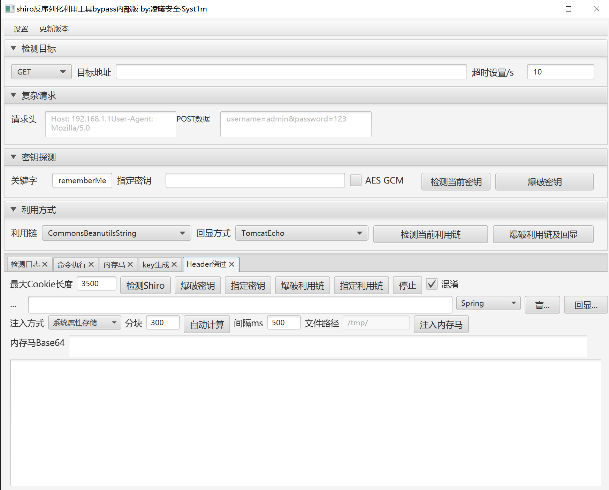

<h1 align="center" >ShiroAttack2 Bypass</h1>
<h3 align="center" >一款针对Shiro550漏洞进行快速漏洞利用</h3>


> 站在巨人的肩膀上，基于 [ShiroAttack2](https://github.com/SummerSec/ShiroAttack2) 二次开发。
>
> By **凌曦安全 Syst1m**


## 新增功能

### Header 绕过（WAF Bypass）

- 在 `rememberMe` Cookie 中插入非 Base64 字符（`$`）绕过 WAF 的 Base64 解码检测，Shiro 的 `discardNonBase64` 机制会自动忽略这些字符
- 支持混淆开关，可关闭以减少 Cookie 长度
- 支持最大 Cookie 长度限制配置

### 短 Payload 利用链爆破
- 基于 `Thread.sleep()` 时间差检测，替代原有回显方式验证利用链，大幅缩短爆破 payload 长度

### 命令执行

- **盲执行**：单次请求，最短 payload
- **回显执行**：两阶段请求（执行+回显），支持 Spring / Tomcat 两种回显方式
  - Spring：通过 `RequestContextHolder` 获取 Response
  - Tomcat：通过 `ApplicationFilterChain.lastServicedResponse` 获取 Response

### 分块内存马注入

- 将大体积内存马 Base64 分块传输，每块通过系统属性 / 线程名 / 文件落地方式存储，最终由 Loader 类拼接加载
- 支持自动计算最优分块大小

### 其他

- AES GCM 加密模式在绕过选项卡同步生效
- 请求头 / POST 数据支持多行输入，可直接粘贴 Burp 数据包
- 支持多版本 CommonsBeanutils gadget（1.8.3 / 1.9.2）





## 使用

```bash
java -jar shiro_attack-1.0-all.jar
```

在 jar 同级目录创建 `data/shiro_keys.txt` 存放密钥字典，`lib/` 目录存放 CommonsBeanutils 依赖。

## 免责声明

该工具仅用于安全自查检测由于传播、利用此工具所提供的信息而造成的任何直接或者间接的后果及损失，均由使用者本人负责，作者不为此承担任何责任。
未经网络安全部门及相关部门允许，不得善自使用本工具进行任何攻击活动，不得以任何方式将其用于商业目的。
该工具只授权于企业内部进行问题排查，请勿用于非法用途，请遵守网络安全法，否则后果作者概不负责
